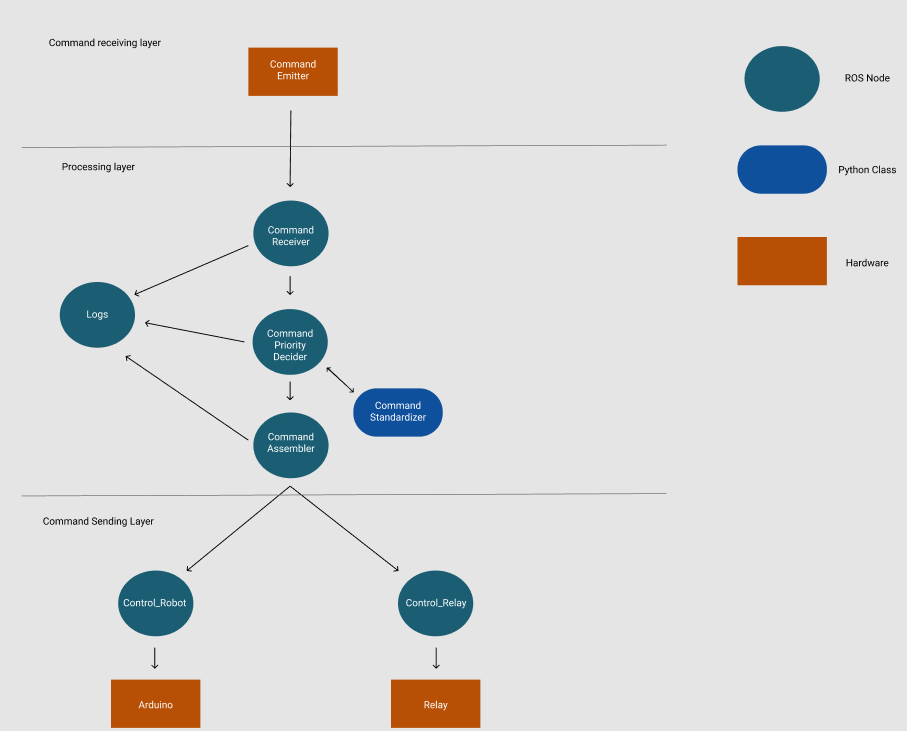

# Lógica de funcionamento do código:
  
  * O código do Raspberry é baseado no ROS(Robot Operating System), e está dividido em camadas para facilitar a implementação de novos componentes, visando a total modularização do código.
  
  * As camadas são 3: 
  
      * 1 - Recepção de comandos por quaisquer meios.
      * 2 - Montagem dos comandos de uma forma que o robô entenda.
      * 3 - Envio dos comandos recebidos para as devidas partes e dispositivos.

  * Segue a estrutura interna do código:

    